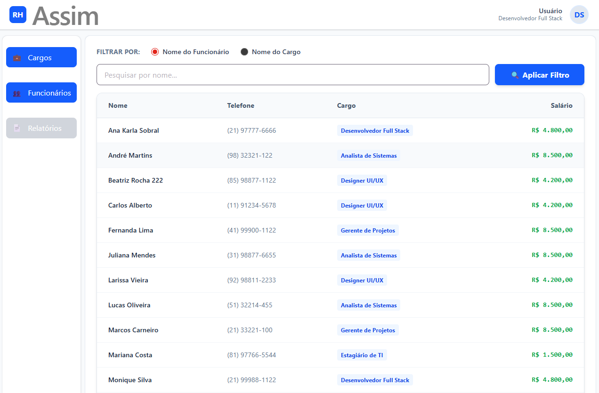
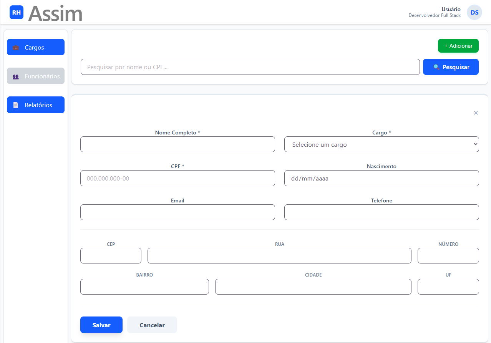
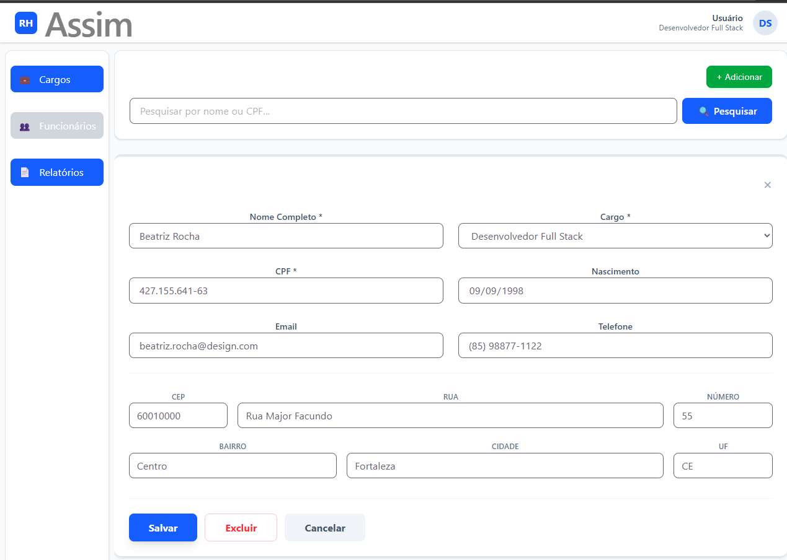

# 🚀 Sistema de Gestão de RH (Full Stack)

Este projeto é uma solução para o gerenciamento de funcionários e cargos, desenvolvida com foco em integridade de dados, performance e experiência do usuário. O sistema permite o controle total (CRUD) de colaboradores, com regras de negócio  e busca dinâmica.

## 📸 Demostração do Sistema

Aqui estão as principais telas da aplicação, focadas em usabilidade e feedback em tempo real.

[](https://raw.githubusercontent.com/zumpchiat/sistemaRH/main/screenshots/demo.mp4)

###  Relatório de Funcionários e Filtros
> A tela principal apresenta relatório com a possibilidade de buscar por **Nome** ou **Cargo**.



### 2. Cadastro de Funcionário (Validações)
> Tela de cadastro de funcionário


### 3. Gerenciamento de Cargos
> Interface para controle de cargos e salários, com a trava de segurança que impede a exclusão de cargos com funcionários ativos.



## 🛠️ Tecnologias Utilizadas

### **Backend (API)**
* **PHP 7.4+** com **Laravel Framework 8.77.1**.
* **MySQL: 5.7.17** Banco de Dados relacional.
* **Carbon:** Manipulação precisa de datas e validação de idade mínima (16 anos).
* **Regex & Custom Rules:** Algoritmo matemático para validação de dígitos verificadores de CPF.
* **Eloquent ORM:** Relacionamentos `HasMany` e `BelongsTo` entre Funcionários e Cargos.

### **Frontend**
* **React.js:** Biblioteca para construção da interface.
* **Axios:** Cliente HTTP para consumo da API.
* **Context API / Hooks:** Gerenciamento de estado e efeitos.

---

## ⚙️ Como Executar o Projeto

### **1. Requisitos Prévios**

**Servidor Local: EasyPHP** 
* **Apache 2.4.43** 
* **PHP 7.4.27**
* **Composer** instalado.
* **Node.js** e **NPM** (para o React).

### **2. Configuração do Backend (Laravel)**
1.  Clone o repositório e acesse a pasta do backend
    copie a pasta **api-sistemaRH** para o servidor web na pasta eds-www (EasyPHP).

2.  Instale as dependências:
    ```bash
    composer install
    ```

3.  Configure o arquivo `.env`:
    * Crie uma cópia: `cp .env.example .env`.
    * Configure suas credenciais do banco de dados (DB_DATABASE, DB_USERNAME, DB_PASSWORD).

4.  Gere a chave da aplicação:
    ```bash
    php artisan key:generate
    ```

5.  **Limpar e Popular o Banco:**
    Este comando criará as tabelas e inserirá 15 funcionários com CPFs válidos e 5 cargos de teste:
    ```bash
    php artisan migrate:fresh --seed
    ```

### **3. Configuração do Frontend (React)**
1.  Acesse a pasta do frontend.
2.  Instale as dependências:
    ```bash
    npm install
    ```
3.  Inicie a aplicação:
    ```bash
    npm run dev
    ```
4. Altere a URL de chamada do backend no arquivo **api.ts** 
    que fica no /src/services/api.ts com a sua URL local

---

## 📡 Documentação da API

* [Backend](backend/api-sistemaRH/README.md)


* [Frontend](frontend/README.md)

